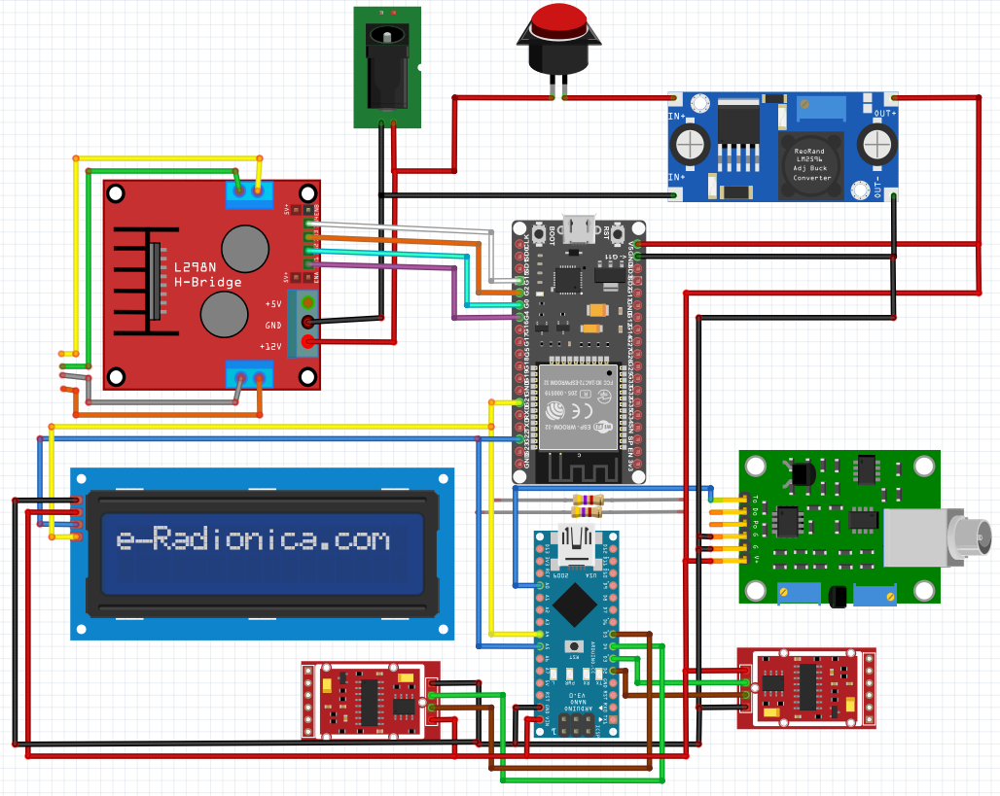
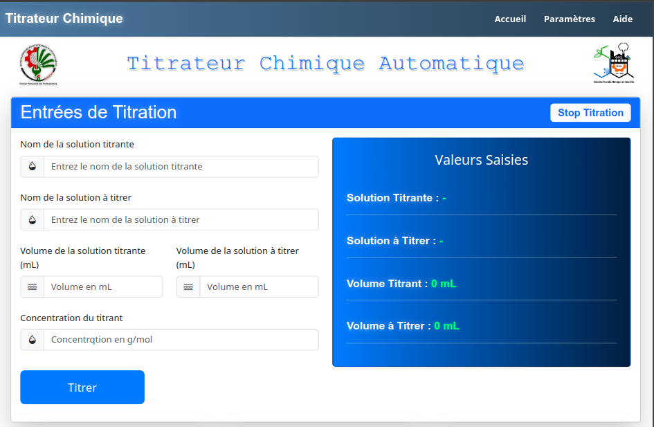
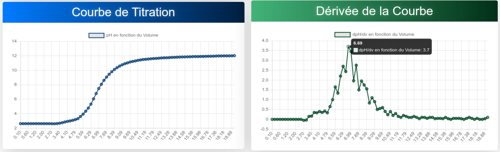
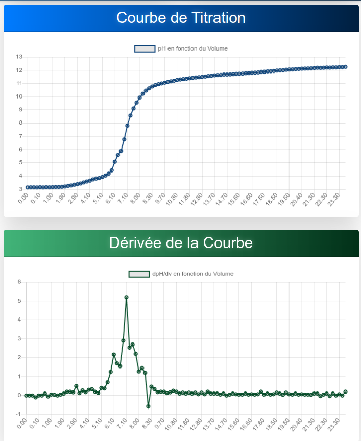
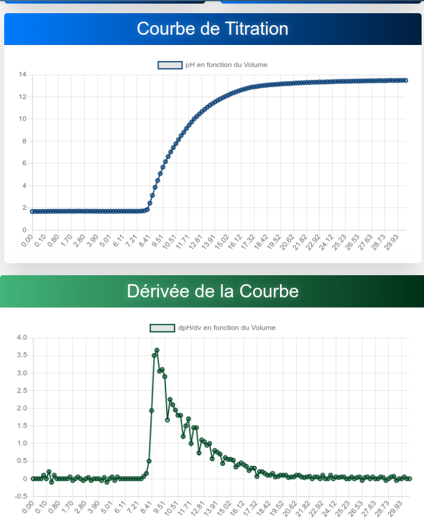
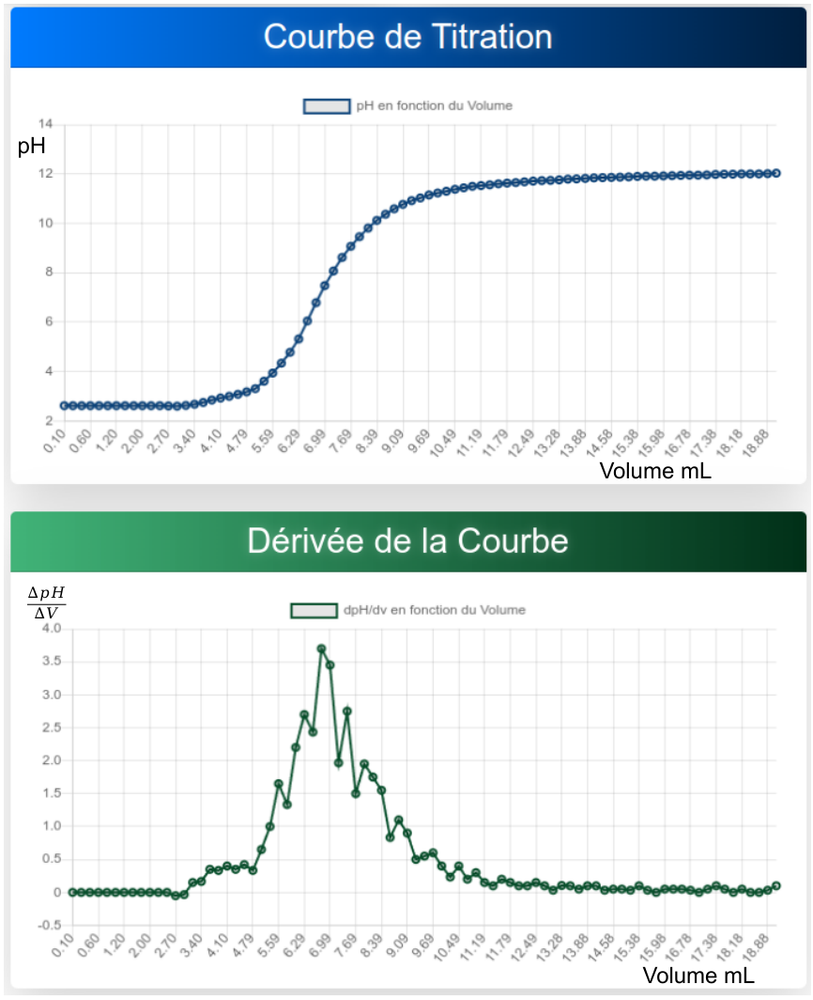
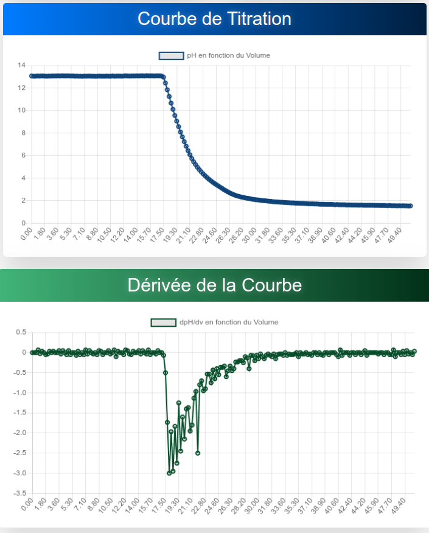

# 🔬 Titrateur Acide/Base Automatisé avec Arduino Nano, ESP32 & Raspberry Pi 3B


## 🚀 Présentation du Projet
Ce projet consiste en la conception et la réalisation d’un titrateur acide/base automatisé basé sur Arduino Nano, ESP32 et un Raspberry Pi 3B. Il vise à améliorer la précision et l'efficacité des titrations chimiques en automatisant le processus et en fournissant une interface utilisateur intuitive accessible via une plateforme web.

### 🎯 Objectifs du Projet
- Développer un système de titration automatisé pour réduire l'erreur humaine.
- Utiliser des capteurs pour mesurer avec précision le pH et la quantité de réactif ajouté.
- Concevoir une interface web pour la gestion des expériences et l'affichage des résultats.
- Permettre un suivi en temps réel des variations du pH et du volume de titrant ajouté.
- Héberger le serveur web sur un Raspberry Pi 3B, qui agit comme commande maître et esclave pour l'ESP32 et l'Arduino Nano.

## 🛠️ Technologies Utilisées
- **Raspberry Pi 3B** : Hébergement du serveur web et gestion centralisée du système
- **ESP32** : Activation des moteurs
- **Arduino Nano** : Gestion des capteurs pH et de poids
- **Communication I2C** : L'Arduino Nano agit comme esclave de l'ESP32
- **Capteurs** : pH-mètre, capteur de poids, électrovannes
- **Node.js & Express** : Serveur pour la gestion des données
- **HTML/CSS/JavaScript** : Interface utilisateur web
- **Chart.js/D3.js** : Visualisation des résultats sous forme de courbes

## 🧰 Liste des Composants et Matériels Utilisés

### 🔌 Microcontrôleurs et Cartes Électroniques
- **ESP32** - [Image](./Titrator/images/esp32.jpg)
- **Arduino Nano** - [Image](./Titrator/images/arduino_nano.png)
- **Raspberry Pi 3B** - [Image](./Titrator/images/raspberry_pi_3b.png)

### 📡 Capteurs et Actionneurs
- **Capteur pH** - [Image](./Titrator/images/capteur_pH.jpg)
- **Capteur de poids (HX711 + cellule de charge)** - [Image](./Titrator/images/charge.jpg)
- **Pompe péristaltique** - [Image](./Titrator/images/pompe.png)
- **Moteurs pour l'agitation et la distribution des réactifs** - [Image](./Titrator/images/moteur.png)


## 📸 Branchement des composants


## 📸 Interface web



## 📌 Installation & Configuration

### 1️⃣ Prérequis
- Raspberry Pi 3B avec Raspbian installé
- Arduino IDE ou PlatformIO
- ESP32 et Arduino Nano avec firmware compatible
- Librairies Arduino : WiFi, Wire (I2C), HTTP, etc.
- Node.js et npm installés sur le Raspberry Pi

### 2️⃣ Cloner le dépôt
```bash
git clone git@github.com:nariIng/memoire.git
cd memoire/Titrator
```

### 3️⃣ Installer les dépendances
```bash
npm install
```

### 4️⃣ Flasher l’ESP32 et l’Arduino Nano
- Configurer le fichier `esp32_maitre.ino` pour l'ESP32 et le téléverser via Arduino IDE.
- Configurer le fichier `nano_esclave.ino` pour l'Arduino Nano et le téléverser via Arduino IDE.

### 5️⃣ Lancer le serveur sur le Raspberry Pi
```bash
npm start
```

## 📊 Interface & Visualisation







L’interface affiche en temps réel les variations de pH et de volume, avec des courbes de titration interactives. L’utilisateur peut suivre l’évolution de la réaction et analyser les résultats via des graphiques dynamiques.

## 📈 Fonctionnalités
✅ Automatisation complète du processus de titration  
✅ Raspberry Pi 3B héberge le serveur et commande l’ESP32 et l’Arduino Nano  
✅ ESP32 gère l'activation des moteurs et agit comme maître de l’Arduino Nano  
✅ Arduino Nano commande les capteurs et est esclave de l'ESP32 via I2C  
✅ Interface web intuitive pour le contrôle et le suivi  
✅ Stockage et affichage des résultats sous forme de graphiques  
✅ Connectivité WiFi pour un accès à distance  
✅ Affichage des courbes de titration en temps réel  
✅ Enregistrement des données expérimentales pour une analyse ultérieure  

## 📥 Télécharger le Mémoire
Le mémoire détaillant la conception et la mise en œuvre de ce projet est disponible en téléchargement :
[📄 Télécharger le mémoire PDF](./Titrator/project_pdf_file/project_pdf_file.pdf)

## 🔗 Liens Utiles
- [Documentation ESP32](https://docs.espressif.com/projects/esp-idf/en/latest/)
- [Documentation Raspberry Pi](https://www.raspberrypi.org/documentation/)
- [Chart.js](https://www.chartjs.org/)
- [Node.js](https://nodejs.org/)

## ✨ Auteur & Contributions
Développé par **NARINDRANJANAHARY Emmanuela** dans le cadre de son mémoire de Master à titre ingénieure en Génie des Procédés Chimiques et Industriels. Contributions bienvenues !

## 📩 Contact
📌 **GitHub** : [github.com/nariIng](https://github.com/nariIng/)  
📌 **LinkedIn** : [linkedin.com/in/emmanuela-narindranjanahary-7194272a7](www.linkedin.com/in/emmanuela-narindranjanahary-7194272a7)

## 📜 Licence
Ce projet est sous licence MIT - voir le fichier [LICENSE](LICENSE) pour plus de détails.

